# Leave Management Portal

## Overview

The Leave Management Portal is a web application designed to handle employee leave requests and approvals. This project utilizes Servlets for server-side processing and HTML, CSS, JavaScript, and Bootstrap for the front-end interface.

## Technologies Used

- **Java Servlets**: For server-side processing and handling requests.
- **HTML**: For structuring the web pages.
- **CSS**: For styling the web pages.
- **JavaScript**: For client-side scripting and interactivity.
- **Bootstrap**: For responsive design and UI components.
- **Tomcat**: For running the Servlets.

## Prerequisites

- **Apache Tomcat**: Ensure that Tomcat is installed and properly configured on your machine.
- **Java Development Kit (JDK)**: JDK 8 or later is required to compile and run the Servlets.
- **IDE (Optional)**: An Integrated Development Environment like Eclipse or IntelliJ IDEA for easier development and deployment.

## Setup Instructions

1. **Clone the Repository**

   ```bash
   git clone https://github.com/A-AnilKumar/leave_management_portal.git

2. **Build the Project**
    ```bash
   mvn clean install


# Features implemented

1. Apply for leave
2. View my Account
3. View My leave Requests
4. My Team leave requests
5. Login and logout
6. Holidays
7. Dashboard ( for my leave summary )
8. User cannot select past date
9. Calculated leaves requesting and taken by excluding weekends
10. Leave type on gender based while applying to a leave


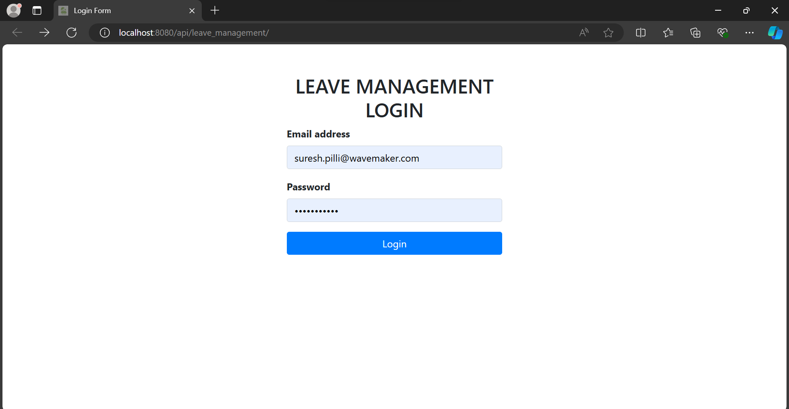


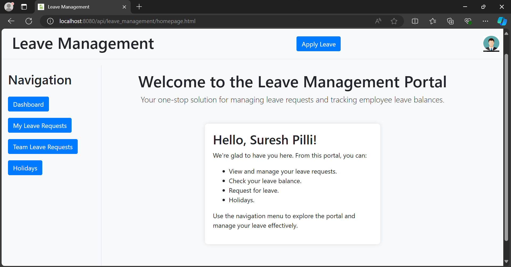


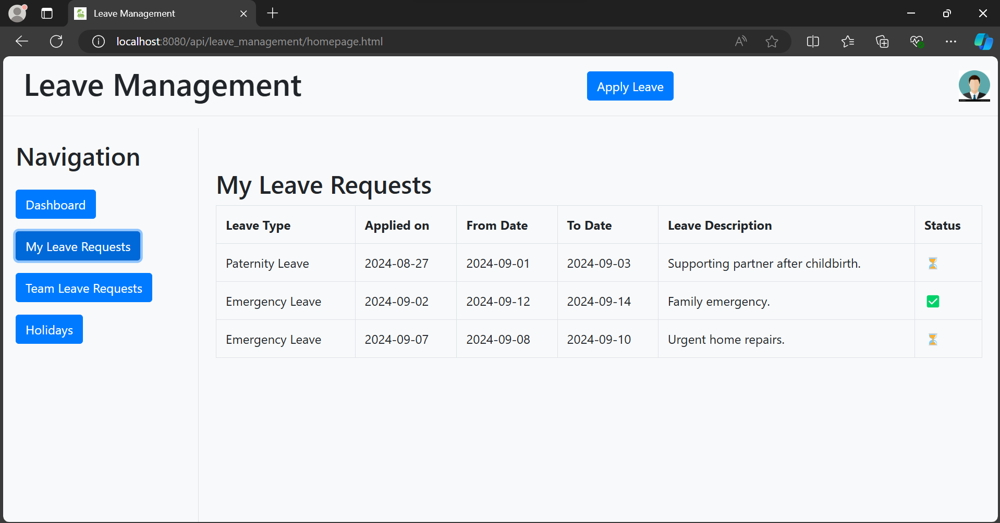


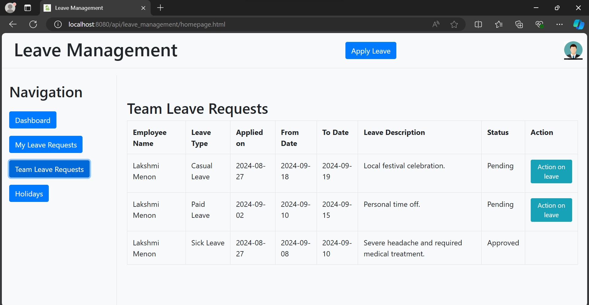


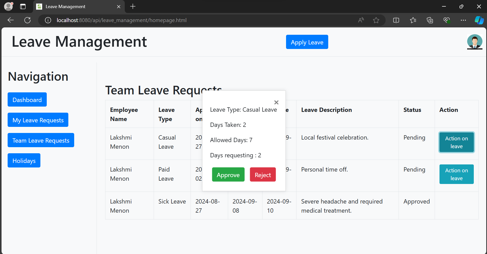


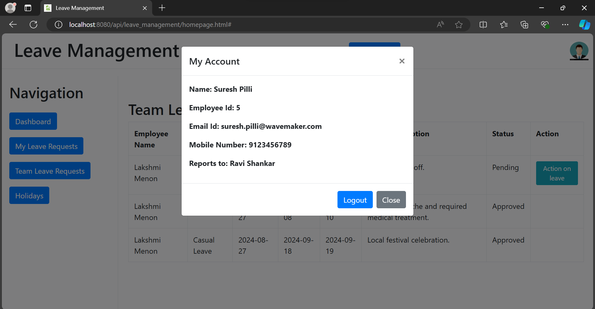


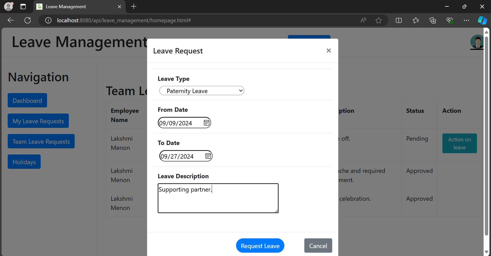


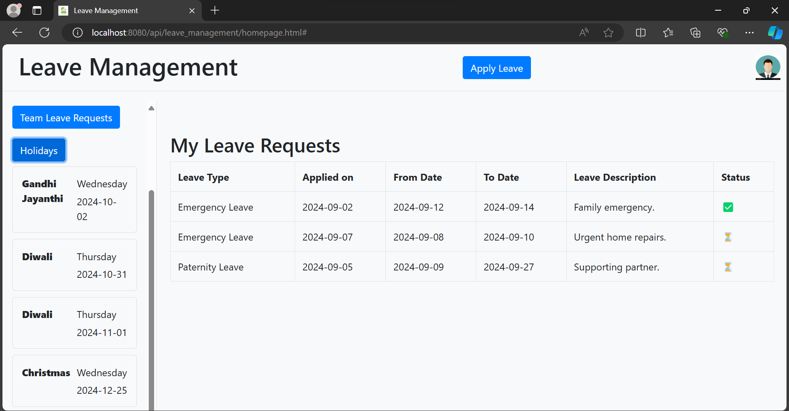


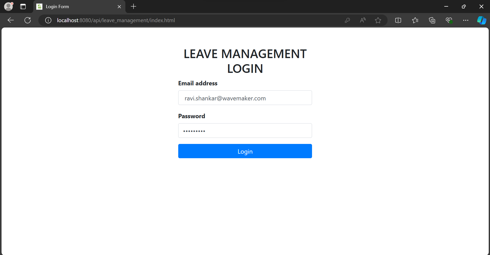


 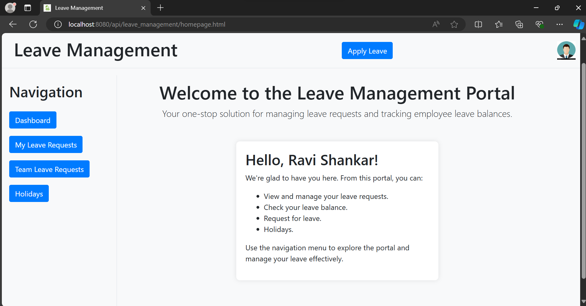
 


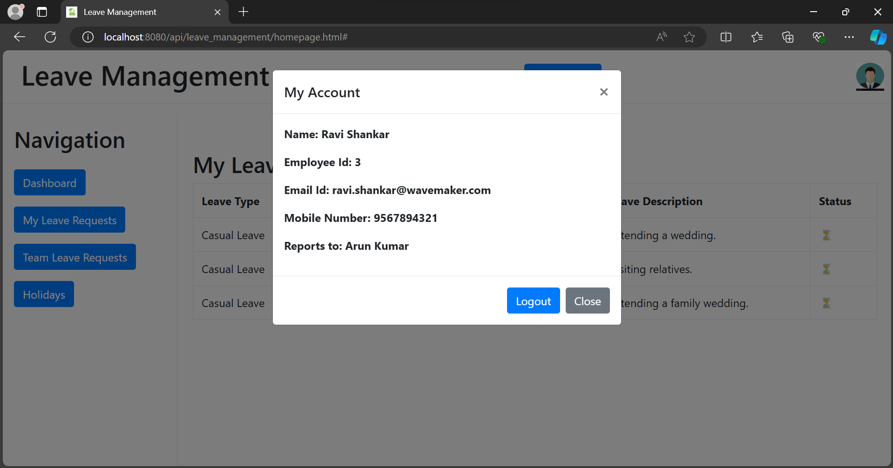


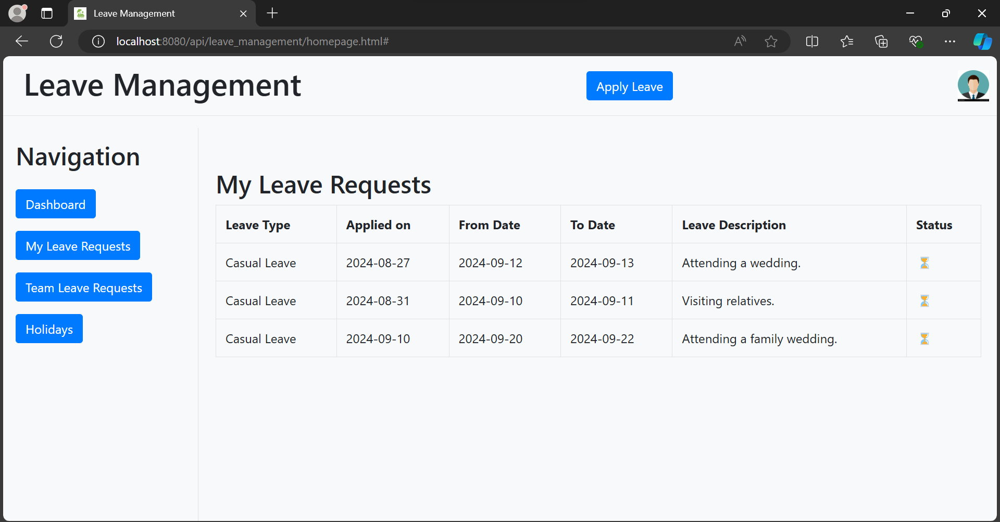


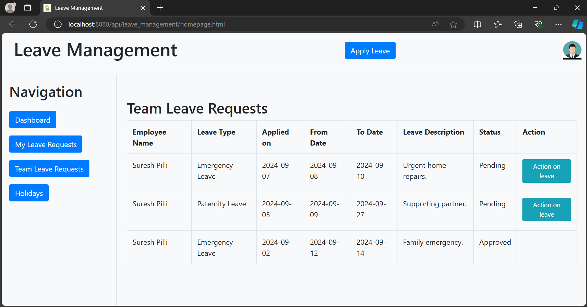


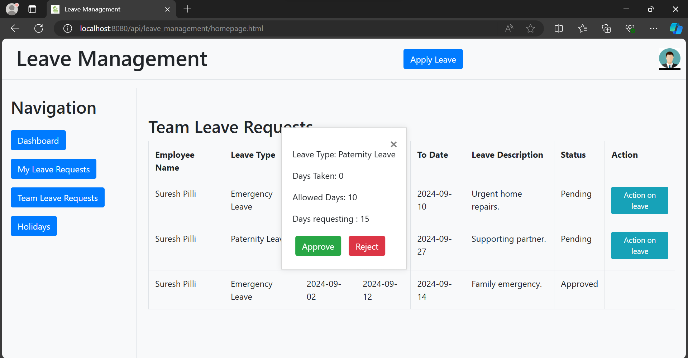


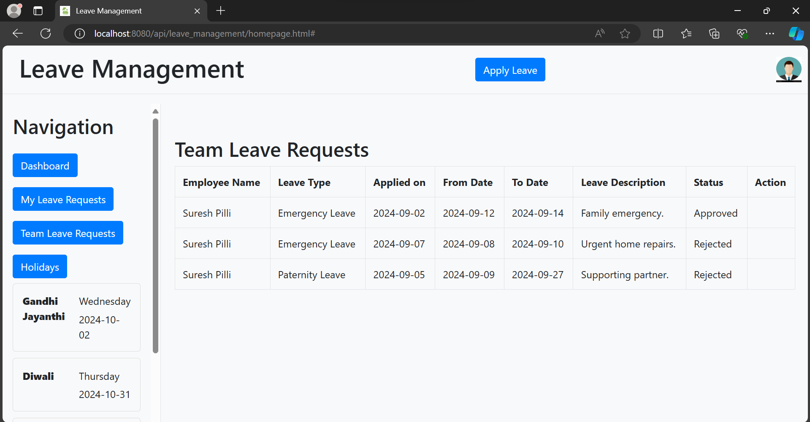


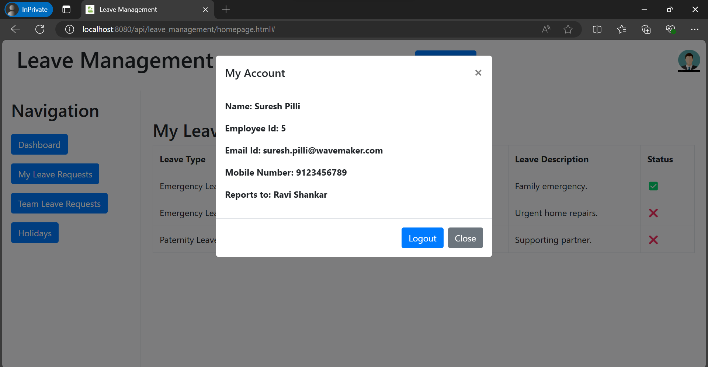


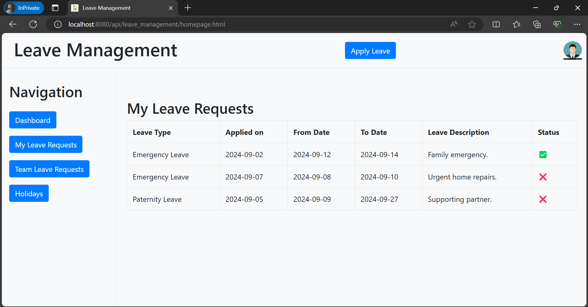


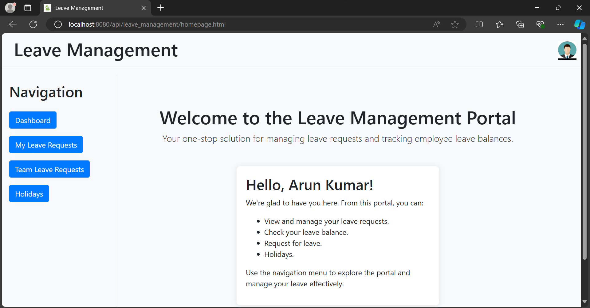


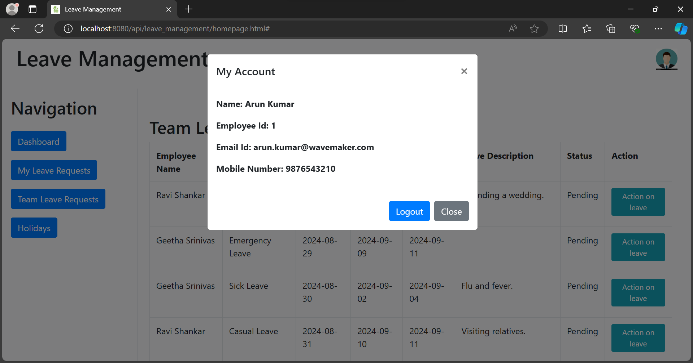


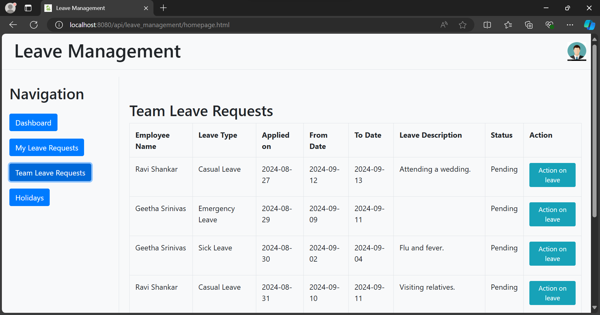


